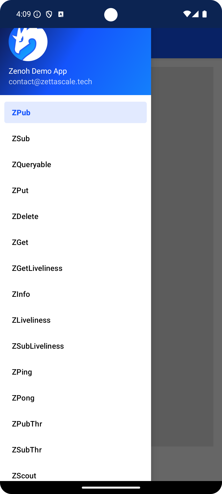
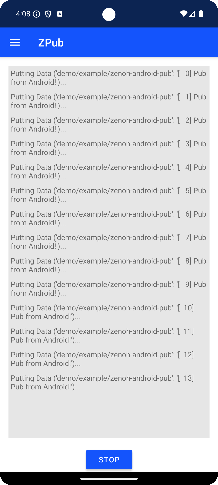

#  Zenoh Android Demo App

An Android application using the [Zenoh-Kotlin bindings](https://github.com/eclipse-zenoh/zenoh-kotlin).

The application features the classic Zenoh examples with the default configuration:

- ZPub: publishes periodically a 'Pub from Android!' into `demo/example/zenoh-android-pub`
- ZSub: declares a subscriber into `demo/example/**`
- ZQueryable: declares a queryable into `demo/example/zenoh-android-queryable`
- ZPut: performs a PUT operation into `demo/example/zenoh-android-put`
- ZDelete: performs a DELETE operation into `demo/example/zenoh-android-put`
- ZGet: performs a GET query into `demo/example/**`
- ZGetLiveliness: performs a GET Liveliness on `group1/**`
- ZInfo: shows information about the Zenoh session
- ZLiveliness: declares a liveliness token on `group1/zenoh-kotlin-android`
- ZSubLiveliness: declares a liveliness subscriber on `group1/**`
- ZPing & ZPong: examples to measure the latency
- ZPubThr & ZSubThr: examples to measure the average throughput
- ZScout: Scouting example for retrieving information on other Zenoh nodes

To select a different example, open the side navigation menu:

 

## Requirements

To install this application, it's required:

- The Android SDK 30+ (so this app is compatible with Android 11)
- Gradle 8
- Because it relies on the Zenoh-Kotlin library which contains the Zenoh-JNI native library, the
  example works on mobile phones with the following CPU architectures:
  - ARM
  - ARM64
  - X86
  - X86_64

## Installation

### Android Studio

The simplest way is to install [Android Studio](https://developer.android.com/studio#command-tools), which makes the installation of the Android SDK straightforward, as well as the Gradle installation. Then we can simply load and build the project.

### Android Command Line Tools

In case we want to install the application without Android Studio then:

1. Install the Android Command Line Tools ([link](https://developer.android.com/studio#command-tools))
2. Export the `ANDROID_HOME` environment variable and update the `PATH` variable as well:
   ```bash
   $ export ANDROID_HOME=/path/to/android-command-line-tools
   $ export PATH=$PATH:$ANDROID_HOME/bin
   ```
3. Install Gradle ([link](https://gradle.org/))
4. On this project's directory, run
   ```bash
   $ gradle wrapper
   $ ./gradlew assembleDebug # or assembleRelease
   ```
5. Install the app:
   ```bash
   $ adb install -r app/build/outputs/apk/debug/app-debug.apk
   ```
6. Run the app on the phone
